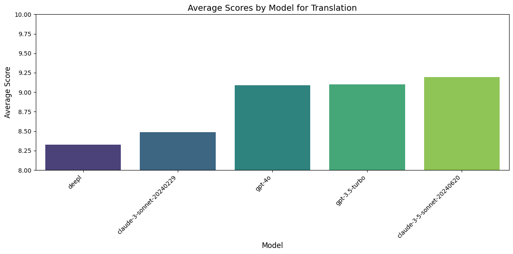
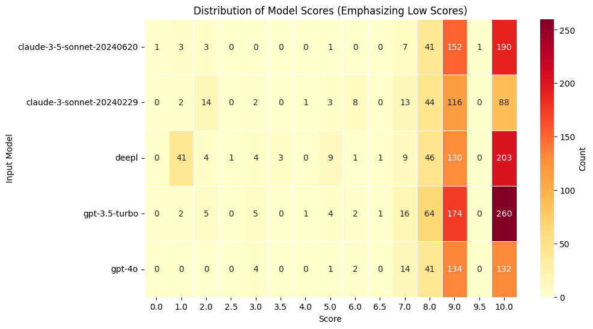

# Translation Comparison
This project, developed for the **Anthropic Summer Hackathon "Build with Claude" June 2024 Developer Contest**, aims to compare the translation capabilities of **Claude**, **OpenAI**, and **Deepl**. It features a **React** frontend utilizing **Vite** for efficient bundling and a **Node.js** backend for server-side operations. Data resulting from the comparisons is stored in a **PostgreSQL** database for analysis. Below, detailed instructions for setup and execution of the project are provided, along with additional pertinent information.

## Table of Contents
- [Video Demo](#video-demo)
- [Insights & Visuals](#insights--visuals)
- [Live Demo](#live-demo)
- [Project Structure](#project-structure)
- [Running the Application](#running-the-application)
- [Environment Variables](#environment-variables)
- [Technologies Used](#technologies-used)
- [APIs Used](#apis-used)


## Video Demo Youtube
- [Overview](https://youtu.be/0cYP4kTb3KQ)
- [ English Chinese Comparison](https://youtu.be/E8dKgj21nRU)
- [English French Comparison](https://youtu.be/T6fgSPTErZs)
## Insights & Visuals
In Short **Claude-Sonnet3.5-20240620** scored highest. However, further analysis would be necessary to confirm this conclusively as GPT3.5 and GPT4o are just slightly below in scores.






### Jupyter Notebook
For a detailed analysis, please refer to the [Collab Notebook](https://colab.research.google.com/drive/1gFPRgGlu9YXaPxxGoLQOhRpq4sIIYPN1?usp=sharing).

## Live Demo
Experience the translation comparison in action at [https://frontendtranslator.onrender.com/](https://frontendtranslator.onrender.com/).

**Please note:** There is a **limit of 20 words** for input to ensure efficient translation comparison due to my token limit.
**First request can take up to 90 seconds to load** After that it is much faster. No longer applicable

**DEEPL API Does not yet work for Hindi nor Chinese and Arabic partially**


## Project Structure
project-root  
│  
├── Backend  
│   ├── src  
│   └── package.json  
│  
├── Frontend  
│   ├── src  
│   └── package.json  
│  
├── .gitignore  
└── README.md 

## Running Application
Clone the repository , install libraries run appl:

   ```sh
   git clone https://github.com/your-username/project-name.git
   cd project-name
   cd Backend
   npm install
   cd Backend
   npm start
    # Navigate to Frontend directory and install dependencies
   cd ../Frontend
   npm install
   npm run dev
   ```
    

## Environment Variables

```plaintext
ANTHROPIC_API_KEY=anthropic_api_key
OPENAI_API_KEY=openai_api_key
DEEPL_KEY=deepl_key_here
DATABASE_HOST=database_host_here
DATABASE_PORT=database_port_here
DATABASE_NAME=database_name_here
DATABASE_USER=database_user_here
DATABASE_PASSWORD=database_password_here
```

## Technologies Used
This project is built using a combination of modern and robust technologies to ensure high performance and scalability. The frontend is developed with **React**, leveraging **Vite** for an optimized build tool that ensures fast reloading and a smooth development experience. The backend runs on **Node.js**, providing a powerful environment for server-side logic. **PostgreSQL** is used as the database, known for its reliability and feature-rich capabilities. The entire application is deployed on **Render**, ensuring seamless deployment and hosting.

## APIs Used

This project integrates several powerful APIs to enhance its functionality:

- **Anthropic Claude**: Utilized for advanced AI-driven text generation and understanding. [Learn more about the Claude API](https://support.anthropic.com/en/collections/5370014-claude-api).
- **OpenAI**: Employs cutting-edge AI models for a variety of tasks including text generation, summarization, and more. [Explore the OpenAI API](https://openai.com/index/openai-api/).
- **Deepl**: Known for its high-quality translations, Deepl's API is used to provide accurate and context-aware language translation services. [Discover the Deepl Pro API](https://www.deepl.com/en/pro-api). (Does not yet work for Hindi nor Chinese and Arabic partially)

These APIs collectively contribute to the project's capabilities, enabling it to perform complex tasks efficiently and effectively.


    


